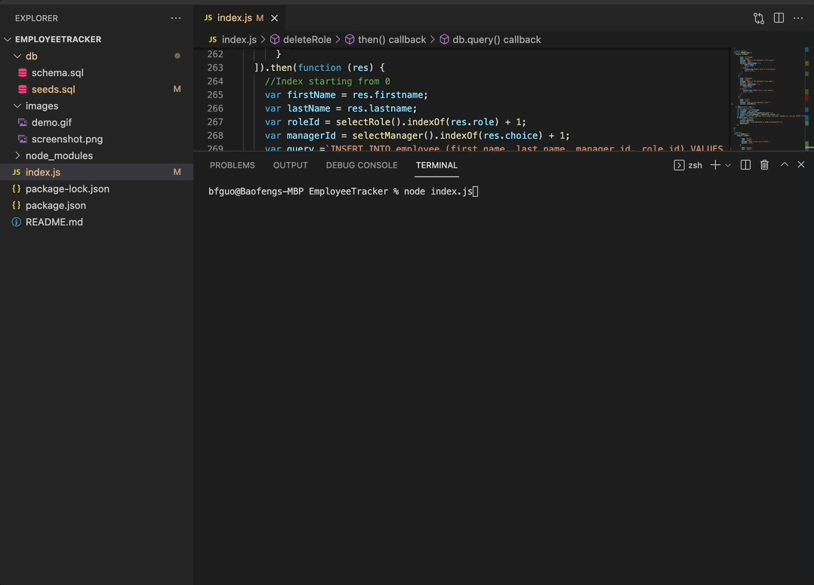
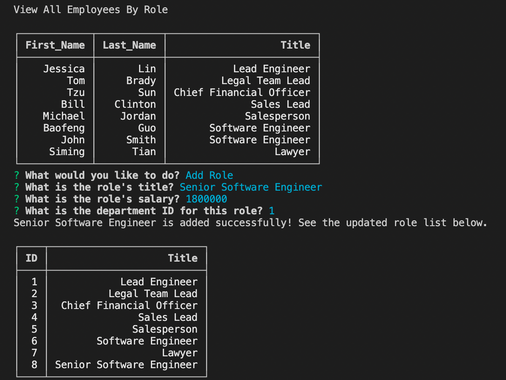
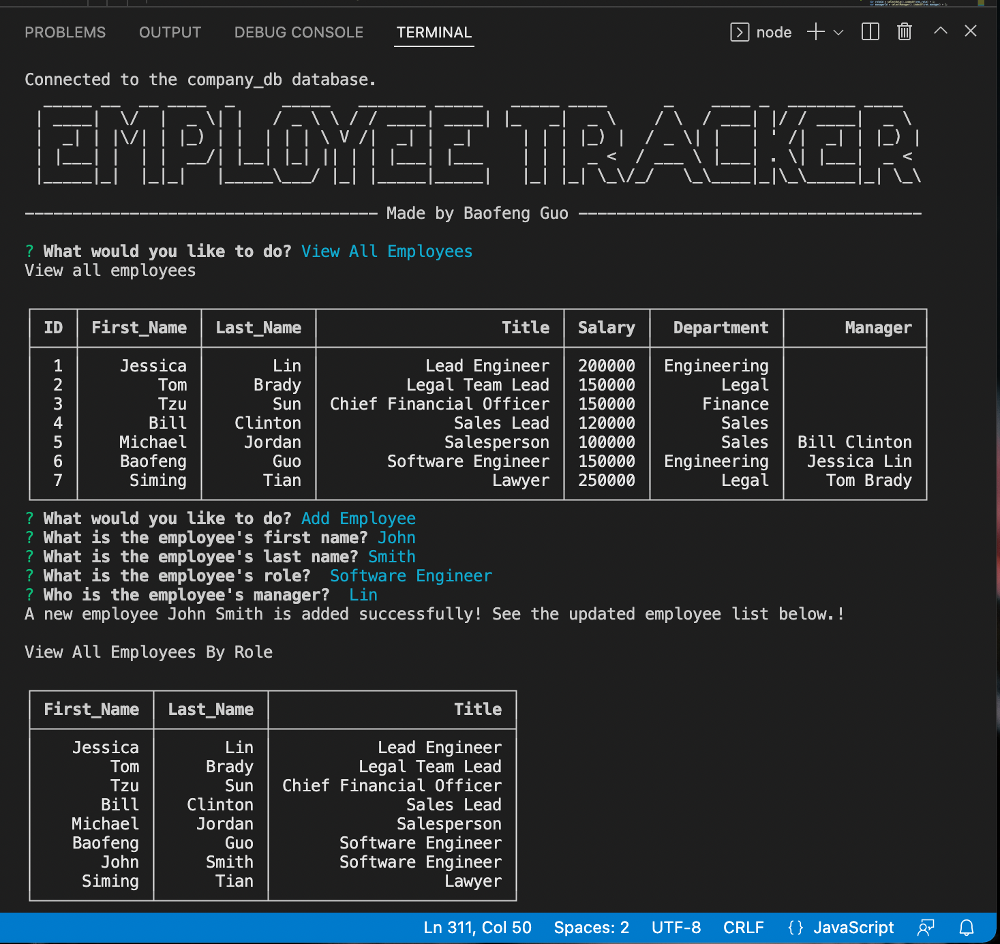

  <h1 align="center">Employee Tracker</h1>
  

## Description
This application is a CLI application using mySQL to create a database management system for employee and company information.

## Table of Contents
- [Description](#description)
- [Table of Contents](#table-of-contents)
- [Installation](#installation)
- [Usage](#usage)
- [Demo](#demo)
- [Built With](#built-with)
- [License](#license)
- [Contributing](#contributing)
- [Tests](#tests)
- [Questions](#questions)

## Installation
`git clone` the repo to your local machine. To use this application, please run the following command:

`npm init` -- creates a package.json file for your application.

And then run the following commands to install the dependencies: 

`npm install inquirer`

`npm install express`

Optional installations:

`npm install console-table-printer --save` -- Printing Simple Table with Coloring rows on your console.

`npm install figlet` -- Generating text banner `Employee Tracker`

**[⬆ back to top](#table-of-contents)**

## Usage
Type the following command in your termimal:

`node index.js`

**[⬆ back to top](#table-of-contents)**

## Demo
Below is the demostration of this application. The walk-through video can be found on my <a href="https://youtu.be/OVuigElEAQo">Youtube Channel</a>.

Screenshot of viewing employees

Screenshot of adding a role

Screenshot of adding an employee and a department

**[⬆ back to top](#table-of-contents)**

## Built With

* [Javascript](https://developer.mozilla.org/en-US/docs/Web/Javascript)
* [NodeJS](https://nodejs.org/en/)
* [ExpressJS](https://expressjs.com/)
* [mySQL](https://www.mysql.com/)
  
**[⬆ back to top](#table-of-contents)**

## License
This application is licensed under MIT license. 

**[⬆ back to top](#table-of-contents)**

## Contributing
This application is developed by <a href="https://www.linkedin.com/in/bfguo/">Baofeng Guo</a>. If you would like to contribute it, please follow the guidelines for how to do so.

**[⬆ back to top](#table-of-contents)**

## Tests
To run tests on the application, run

`npm install jest`

and then `npm run test` from the command line.

**[⬆ back to top](#table-of-contents)**

## Questions
For any question, please contact me on GitHub: [magickw](https://github.com/magickw) or email me at peterguo1983@gmail.com.

**[⬆ back to top](#table-of-contents)**

